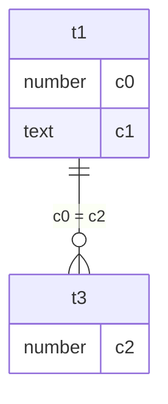

# Design: Mermaid vs. text rendering for join-path reasoning — anonymized-Spider eval

- **Date:** 2026-06-07
- **Status:** Approved design (pre-implementation)
- **Owner:** Qing
- **Topic:** Does rendering a table-relationship graph as Mermaid (vs. XML vs. natural-language adjacency) help an LLM pick the correct multi-table join path?

## 1. Motivation

`agentic-data-contracts` exposes table relationships to an agent so it can compose correct multi-table SQL
(see `semantic/base.py::Relationship`, `build_relationship_index`, `find_join_path`, and the XML rendering in
`core/prompt.py::ClaudePromptRenderer._render_relationships`). A proposal (inspired by TencentDB-Agent-Memory's
use of Mermaid as a memory carrier) is to render the relationship graph as **Mermaid** instead of XML, on the
theory that graph notation is more traversable for the model.

Before investing in a renderer + integration, we want **empirical evidence** that the rendering format changes
join-path-selection accuracy. This experiment provides that evidence cheaply and standalone, decoupled from the
library.

## 2. Background (priors from the literature)

These findings shape the design (full citations in the conversation that produced this spec):

- **Talk like a Graph (ICLR 2024):** graph *encoding format* swings LLM accuracy by up to 60%, but the effect is
  task- and structure-dependent and concentrates on multi-hop/path tasks. → Stratify by hop count.
- **Graph Linearization (2024):** *node ordering* (degree/PageRank, locality) matters as much as surface syntax;
  on path tasks gains were modest (+8.5 pts shortest-path on an 8B model). → Control ordering; expect small effects.
- **Lost in Serialization (2025):** LLMs are *non-invariant* to edge reordering / relabeling; large non-fine-tuned
  models are far more robust. → Treat robustness as a metric; expect weaker models to be more format-sensitive.
- **Death of Schema Linking? (2024):** strong models barely benefit from representation help on small schemas;
  sensitivity *decreases* with capability. → Expect a possible null on Sonnet; expect larger effect on DeepSeek.
- **Contamination:** Sonnet 4.6 training-data cutoff is **Jan 2026**; Spider (2018) is contaminated. Contamination
  biases a paired rendering A/B toward a **false null** (model recalls the answer regardless of rendering). →
  Anonymization is mandatory to force the model to read the provided graph.

## 3. Hypotheses

- **H1 (primary):** For a fixed model, join-path reconstruction accuracy differs across renderings
  (XML vs. Mermaid vs. NL-adjacency), with the difference growing as the number of required join edges increases.
- **H2 (secondary, capability gradient):** Any rendering effect is larger for the weaker model
  (DeepSeek V4 Flash) than for the stronger model (Sonnet 4.6).
- **Null result is a valid, valuable outcome:** "no significant difference" tells us Mermaid is not worth the
  integration effort for this regime.

## 4. Task definition — opaque tokens + join-path reconstruction

Opaque-token anonymization is incompatible with Spider's natural-language questions (the model cannot map
"singer's age" to `t1.c3`). We therefore use a **join-path reconstruction** task, which isolates graph traversal
with zero name-semantics leakage and maps directly onto the shortest-path literature, grounded on real Spider
topologies.

**Per item:**

- Input to the model: a rendered schema graph (one of three renderings) of the anonymized database, plus a
  specified set of **endpoint tables** = the set of tables referenced in the gold query's `FROM`/`JOIN` clauses.
- Required output: the **join conditions** needed to connect those endpoint tables (including any intermediate
  bridge tables), as a JSON list of `t_a.c_i = t_b.c_j` equalities. Raw SQL is also accepted (parsed as fallback).
- Gold: the set of join edges in the human-authored gold SQL.

The model must (a) find which tables to traverse and (b) choose the correct join columns — the core of join-path
selection. The NL question is intentionally **not** provided; it is a confound for this measurement.

## 5. Datasets

- **Source:** Spider **dev** set — `tables.json` (schemas + `foreign_keys`, `column_names`, `table_names`) and
  `dev.json` (gold SQL). No SQLite databases and no query execution are required; all grading is static.
- **Acquisition:** download `tables.json` and `dev.json` (HuggingFace mirror or direct); robust to source with a
  documented fallback. Cached locally under `data/` (gitignored).
- **Filtering:** keep items whose gold SQL has **≥ 2 join edges** (counted via `sqlglot`). Stratify into
  **2 / 3 / 4+** join-edge buckets.
- **Ambiguity flag:** for each item, compute whether more than one valid path connects the endpoint tables in the
  FK graph; mark such items `ambiguous=true` (exact-match is unreliable there; F1 remains primary).

## 6. Anonymization (opaque tokens)

- Deterministic per-database remap: tables `table_names[i] → t{i}`, columns `column_names[j] → c{j}`
  (column ids are global in Spider's `tables.json`; map to `t{table}.c{local_index}` for readability).
- Applied consistently to: the schema graph, the gold SQL (identifier rewrite via `sqlglot`), and the endpoint
  table list. The mapping is bijective and round-trippable.
- No semantic hints survive (no type-named columns, no `_id` suffixes). Column data **types** are retained
  (e.g., `number`, `text`) since they carry no entity semantics but are realistic schema content.

## 7. Renderings (same anonymized graph, three surfaces)

All three encode identical information (tables, columns+types, FK edges, cardinality where known). Node/edge
**ordering is fixed and identical** across renderings (tables by index, edges sorted lexicographically) to avoid
confounding ordering with format.

**XML** (mirrors the library's current `_render_relationships` style):
```xml
<schema>
  <table name="t1"><column name="c0" type="number"/><column name="c1" type="text"/></table>
  ...
  <relationships>
    <rel from="t1.c0" to="t3.c2" type="many_to_one"/>
  </relationships>
</schema>
```

**Mermaid** (topology-first; attributes via edge labels):

(We will pilot both `erDiagram` and a lighter `graph LR` flowchart form; default `erDiagram`.)

**NL-adjacency** (verbose adjacency list — the format KG-prompting work found competitive):
```
t1 has columns c0 (number), c1 (text).
t1 joins to t3 via t1.c0 = t3.c2 (many_to_one).
```

## 8. Prompt template (single-shot)

System: "You connect database tables. Given a schema and a set of tables, output only the JOIN conditions needed
to connect them, as a JSON array of strings like \"ta.cx = tb.cy\". Use only columns present in the schema."

User: `<rendering>` + "Connect these tables into a single joined query: [t1, t3, t7]. Return the minimal set of
join conditions as a JSON array."

- `thinking` disabled / no extended reasoning (cost control + the task is short).
- Output parsed as JSON array; fallback: parse as SQL via `sqlglot` and extract equality join predicates.

## 9. Models

| Role | OpenRouter slug | Pricing (in/out per Mtok) |
|---|---|---|
| Strong (target) | `anthropic/claude-sonnet-4.6` | $3.00 / $15.00 |
| Weak (gradient) | `deepseek/deepseek-v4-flash` | $0.098 / $0.197 |

Accessed via OpenRouter's OpenAI-compatible endpoint. Key read from `OPENROUTER_API_KEY` in the environment
(sourced from `/Users/qingye/Documents/lens/.env`); **never copied into this repo or committed**.

## 10. Grading & metrics

- A join edge is the unordered pair `{ta.cx, tb.cy}`. Gold edges = equality join predicates in gold SQL
  (`ON` and `WHERE`), extracted with `sqlglot`. Self-joins handled via alias-aware comparison.
- **Per item, per (model × rendering):**
  - **Edge F1** (primary) — precision/recall over the undirected edge set.
  - **Exact-match** (secondary) — model edge set == gold edge set (skipped/flagged for `ambiguous` items).
  - **Hallucinated-edge rate** — fraction of output edges not present in the FK graph at all.
- Persist one row per call to `results/results.jsonl`:
  `{item_id, db_id, n_joins, ambiguous, model, rendering, gold_edges, pred_edges, f1, exact, hallucinated, in_tok, out_tok, cost_usd}`.

## 11. Statistics

- Report mean F1 and exact-match per **(model × rendering × stratum 2/3/4+)** with bootstrap 95% CIs.
- **Paired McNemar** on exact-match between rendering pairs (XML↔Mermaid, XML↔NL, Mermaid↔NL), per model, since
  every item is seen under all renderings.
- Note effect sizes and whether they clear the CI; explicitly report null results.
- (Robustness check deferred — see §15.)

## 12. Architecture

Standalone, decoupled from the library. New directory:

```
experiments/mermaid-joinpath-eval/
  pyproject.toml         # deps: openai, sqlglot, requests, scipy, pydantic, pytest
  data.py                # acquire + parse tables.json/dev.json; filter by join count; ambiguity flag
  schema_graph.py        # SchemaGraph model; gold join-edge extraction via sqlglot
  anonymize.py           # deterministic opaque remap of graph + gold SQL (bijective)
  renderers.py           # render_xml() · render_mermaid() · render_nl_adjacency()
  prompt.py              # build_prompt(rendering, endpoint_tables)
  model_client.py        # OpenRouter call (OpenAI-compatible), retries, token+cost accounting
  grade.py               # parse model output → edges; F1 / exact / hallucinated vs gold
  runner.py              # orchestrate items × renderings × models; budget cap; write results.jsonl
  stats.py               # strata, McNemar, bootstrap CIs; summary table
  tests/                 # TDD for every deterministic unit; model_client via mock
  data/  results/        # gitignored
  README.md              # how to source the key and run
```

Each module has one purpose and a small interface; deterministic modules (`schema_graph`, `anonymize`,
`renderers`, `grade`) are pure and independently testable.

## 13. Budget controls (hard requirement)

Current OpenRouter balance ≈ **$2.37**. Therefore:

- `runner.py` token-counts every rendered prompt and **prints a total cost estimate before any API call**.
- `--max-spend` cap (default **$2.00**) aborts the run mid-stream if projected/actual spend exceeds it.
- Defaults sized to fit: **N ≈ 45 items × 3 renderings × 2 models × 1 sample**
  (Sonnet ≈ $1.3–1.7; DeepSeek negligible). Hard-filtered to the hardest strata first (prefer 3+ joins).
- `--n`, `--samples`, `--models`, `--renderings` configurable to scale up after a top-up.

## 14. Testing strategy (TDD)

Verifiable here without an API key or budget:

- `anonymize`: bijective round-trip; gold SQL rewritten consistently with the graph; no semantic tokens leak.
- `schema_graph`: gold join-edge extraction on hand-written SQL (incl. self-join, `WHERE`-style joins) → known edges.
- `grade`: hand cases for F1 (partial credit), exact-match, hallucinated edges, alias handling.
- `renderers`: each emits parseable output and is information-equivalent (same edge set recoverable).
- `model_client`: exercised against a **mock** transport (no live calls in tests).

The only step not verifiable here is the live OpenRouter call; it runs behind a single documented command.

## 15. Out of scope / future work

- **Realistic NL-question arm** (requires plausible-novel naming, not opaque) — a separate study if reconstruction
  shows a signal.
- **External-validity arms:** Termite (genuinely uncontaminated, tiny) as a sanity check; SQaLe (large, `num_joins`
  metadata) anonymized for scale — both deferred until the primary anonymized-Spider result is in.
- **Order-invariance robustness test** (shuffle edge order / relabel, measure output stability) — deferred;
  hooks left in `renderers` (fixed ordering today) to add a shuffled condition later.
- **Library integration** of a Mermaid renderer — only if the experiment justifies it.

## 16. Risks & mitigations

- **Ceiling effect / null on Sonnet:** likely per the schema-linking literature; mitigated by including DeepSeek
  (H2) and by targeting the hardest strata. A true null is an accepted outcome.
- **Multi-path ambiguity:** flagged per item; F1 is primary, exact-match skipped on ambiguous items.
- **Output parse failures:** JSON-first with sqlglot SQL fallback; unparseable → scored as zero and counted
  separately so parse failures don't masquerade as reasoning failures.
- **Budget overrun:** hard `--max-spend` cap + pre-call estimate.
- **Mermaid dialect variance:** pilot both `erDiagram` and `graph LR`; pick the better-parsed default.

## 17. Success criteria for the experiment

The experiment succeeds (regardless of which way it points) when it produces, within budget:
a per-(model × rendering × stratum) F1/exact-match table with CIs and paired McNemar p-values, on anonymized
(decontaminated) real Spider schemas, with parse-failure and ambiguity rates reported — enough to decide
**go / no-go** on building a Mermaid renderer for the library.
